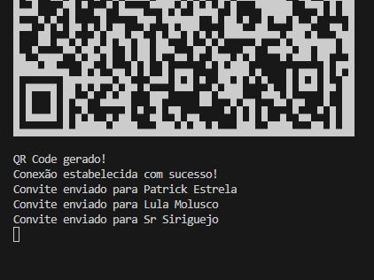
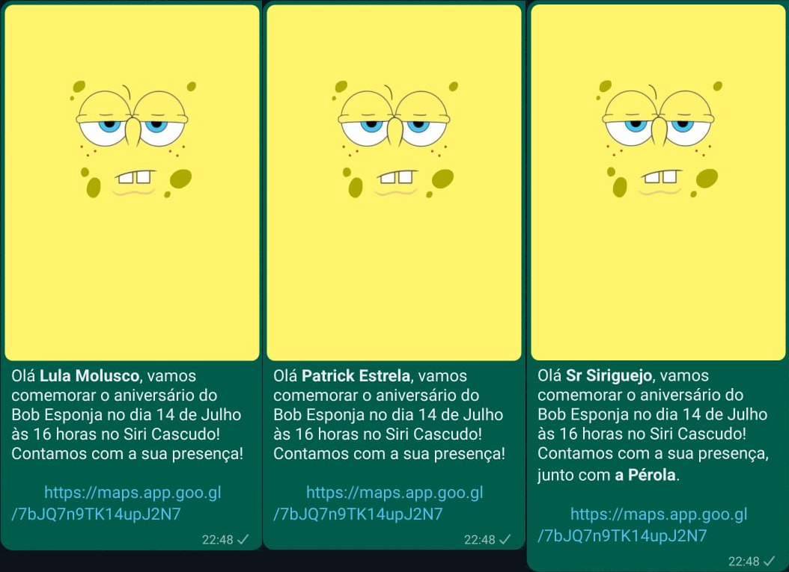

<h1 align="center">
  Bot WhatsApp - Convites
</h1>
<div align="center">
  
  
</div>

<br/>

<center>

&nbsp;
 &nbsp;

</center>

<br />

# 📰 Description / Descrição

🇺🇸 - Bot developed using the whatsapp-web library, created to meet my need to send my daughter's birthday invitations in a personalized way.</a>.

<br />
🇧🇷 - Bot desenvolvido utilizando a biblioteca whatsapp-web, criado para suprir minha necessidade de enviar os convites do aniversário de minha filha de modo personalizado.</a>.

<br />

# 👷🔧 Built With / Construído Com

🇺🇸 - This project was built using these technologies:<br />
🇧🇷 - Este Projeto foi construído utilizando essas tecnologias:
- Javascript
- NodeJS
- Biblioteca whatsapp-web.js
- Biblioteca qrcode-terminal

<br />

# 📎 How to Run / Como Executar

<details>

<summary> Instruções/Instructions </summary>

🇺🇸 - Install project dependencies:

🇧🇷 - Instale as dependências do projeto:
````
npm install
````
or
````
yarn install
````
<br />

🇺🇸 - Customize the message to be sent:

🇧🇷 - Personalize a mensagem a ser enviada:
````
  if (family.length > 0) {
    message = `Sua mensagem para *${name}* junto com *${family}*`;
  } else {
    message = `Sua mensagem somente para *${name}*`;
  }
  ````
<br />

🇺🇸 - Update the image file at 'assets/invitation.png' with your invitation.

🇧🇷 - Atualize o arquivo de imagem em 'assets/invitation.png' com o seu convite.


<br />
🇺🇸 - Update the contacts.json file with the name of the main contact, telephone number (following the pattern DDI+DDD+NUMBER@c.us) and the family members to be invited, if any.

<br />
🇧🇷 - Atualize o arquivo contacts.json com o nome do contato principal, o telefone (seguindo o padrão DDI+DDD+NUMERO@c.us) e os familiares a serem convidados, se houver.


<br />
🇺🇸 - Run the application in the terminal with:

🇧🇷 - Execute o aplicativo no terminal com:
````
node botInvitation.js
````


<br />
🇺🇸 - With your WhatsApp app, go to Connected devices > Connect a device and read the generated QRCode! Once connected, the system will automatically send the invitation to all numbers registered in the JSON file and automatically disconnect.

<br />
🇧🇷 - Com seu aplicativo whatsapp, vá em Aparelhos conectados > Conectar um aparelho e faça a leitura do QRCode gerado! Após conectado o sistema irá enviar automaticamente o convite para todos os números cadastrados no arquivo JSON e realizará a desconexão automaticamente.

<br />
</details>

# 
[](https://www.linkedin.com/in/jpvasques/)
[](https://vasques.dev)